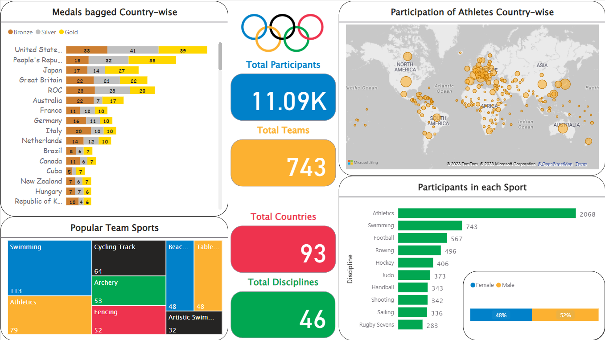
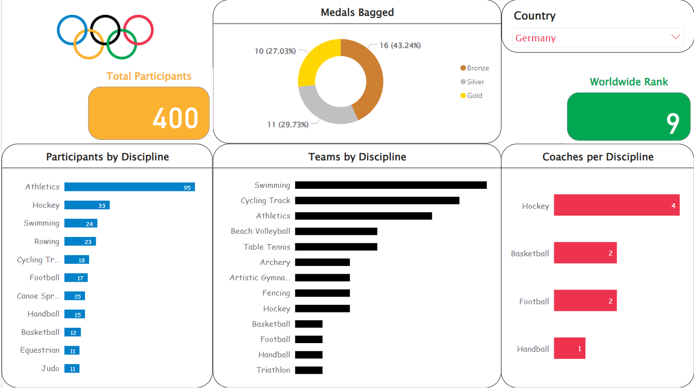

# Tokyo Olympics Dashboard

The modern Olympic Games or Olympics are the leading international sporting events featuring summer and winter sports competitions in which thousands of athletes from around the world participate in a variety of competitions. Tokyo 2020 Summer Olympics was the 32nd Olympiad which was held from 23rd July to 8th August, 2021 in Tokyo, Japan. The Tokyo Olympics showcased the evolution of the Olympic programme with the debut of sports such as skateboarding, sport climbing, surfing and karate as well as events such as BMX freestyle and 3x3 basketball.

An interactive report is created using Power BI to visually display the details regarding participation of individual players, teams and their coaches. Additionally, the country from which the player comes from and the sporting event they participate in enables a richer understanding of the Tokyo Olympics. Two dashboards are created- one featuring the overall analysis of the Tokyo Olympics and the other is country specific participation and performance of their players.

